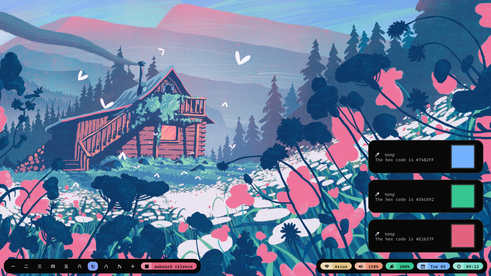

# rang

A color picker for wayland

  

`rang` is a simple color picker script that I use on my system. It relies upon the following to do its thing:
- [grim](https://github.com/emersion/grim)
- [slurp](https://github.com/emersion/slurp)
- [wl-copy](https://github.com/bugaevc/wl-clipboard)
- notify-send

DISCLAIMER: The script is for my personal use and I figured it could serve as a base for anyone interested in building something more portable or configurable. It doesn't even test for the dependencies so make sure you already have them installed before you use this. I'm welcome to any PRs or advice to make this more portable or configurable.

## Installation
Just move `rang.sh` to anywhere on your `$PATH` and launch it by binding it to a key or create a `.desktop` file and launch it using your preferred launcher.

## Usage
Launching `rang` launches grim with slurp to pick any spot on your screen and then prints a fancy notification while also copying the hex code to the clipboard.

